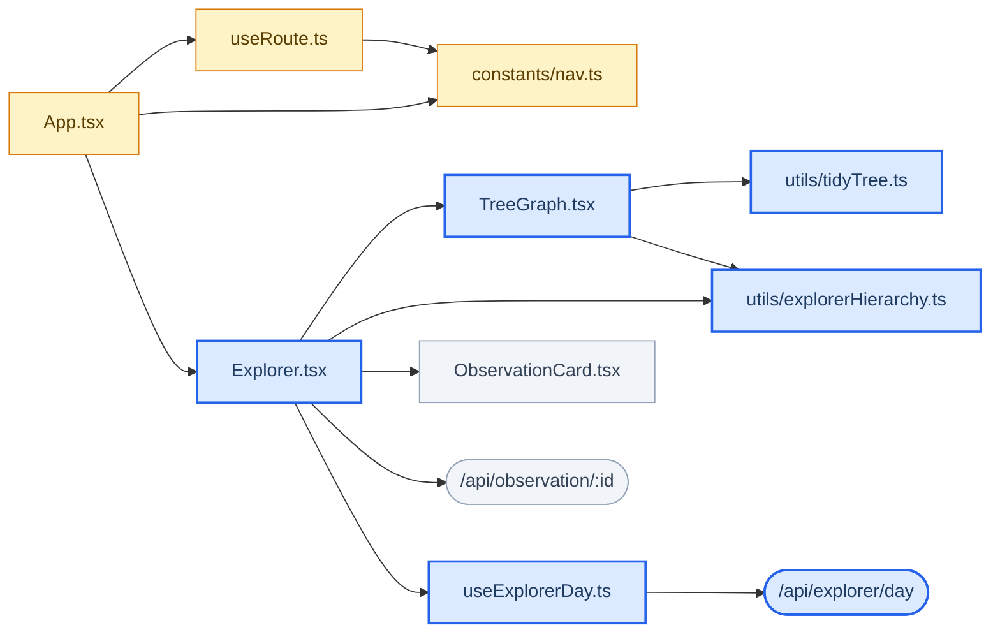
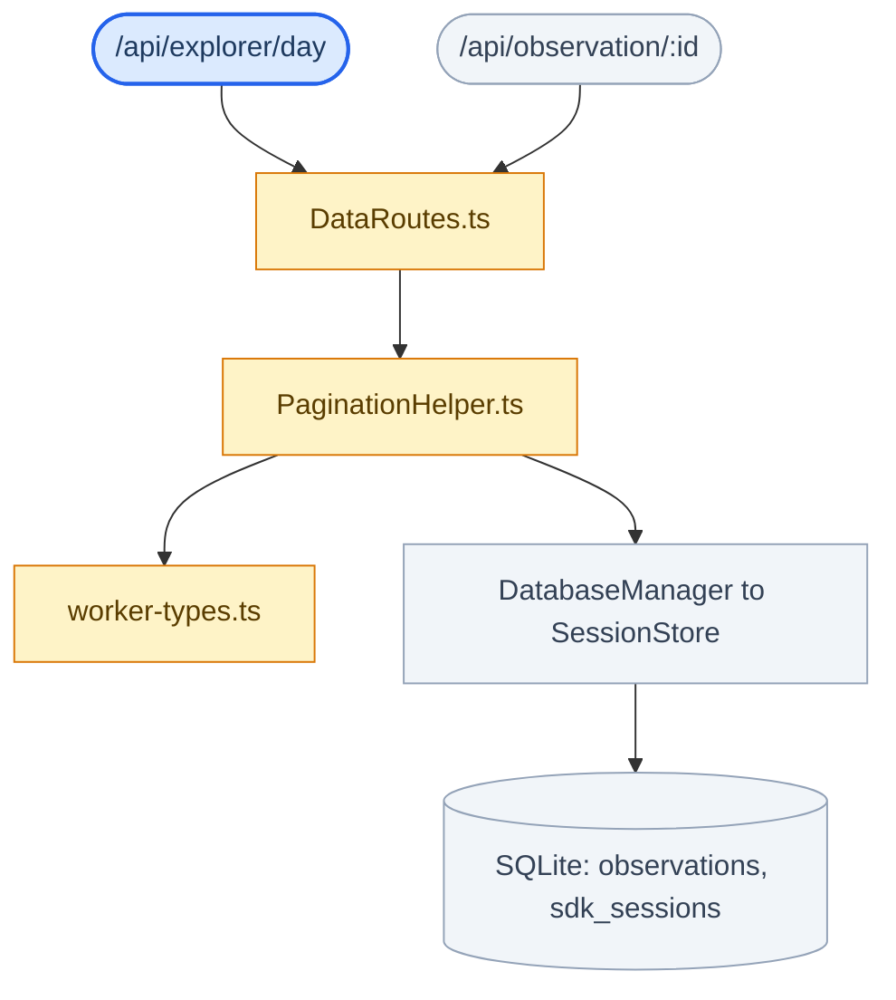

The [Explorer tab](/usage/viewer-explorer) spans the React viewer, the worker's
HTTP layer, and SQLite. Below is every edge between them, taken from the actual
`import` statements and route registrations rather than drawn from memory.

The whole graph is acyclic with a single root, `App.tsx`. It is split in two
here only so the labels stay readable — the two HTTP endpoints are the seam,
appearing as leaves in the first graph and roots in the second.

Blue nodes were added for Explorer, amber nodes already existed and were
modified, grey nodes are used unchanged.

## Viewer side

## Worker side

## What the shape tells you

**The layout is split from the data.** `tidyTree.ts` knows nothing about
memory; it turns any tree into positioned nodes. `explorerHierarchy.ts` knows
nothing about pixels; it turns a day's rows into a tree. `TreeGraph.tsx` is the
only file that holds both, which is why the two grouping modes cost no extra
request — they are a different call into the second file, not a different
fetch.

**Two endpoints, both through `DataRoutes.ts`.** The day endpoint feeds the
graph; the single-observation endpoint exists only for the detail panel and for
deep links, which have to resolve an id before any day is known.

**The tree carries two session ids.** `sessionId` is the `memory_session_id`
observations actually hold; `contentSessionId` is what the session tier groups
on, because the worker rotates the former whenever a session continues.

**Nothing points back up.** No worker module imports a viewer module, and no
util imports a component, which is what keeps the graph acyclic. A new edge
that violates this — a shared helper importing `App.tsx`, say — would introduce
a cycle and should be split instead.
