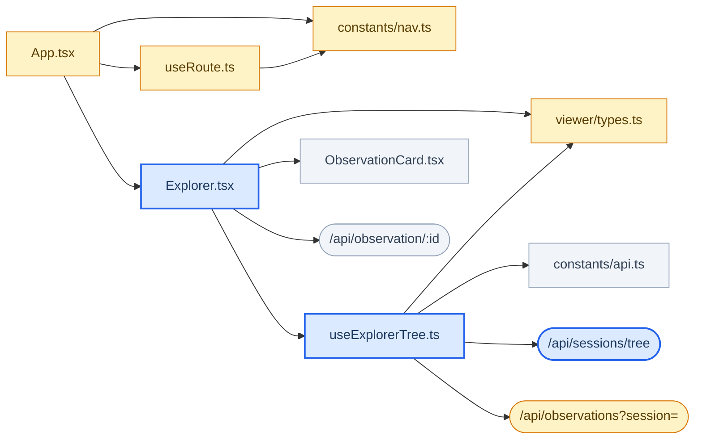
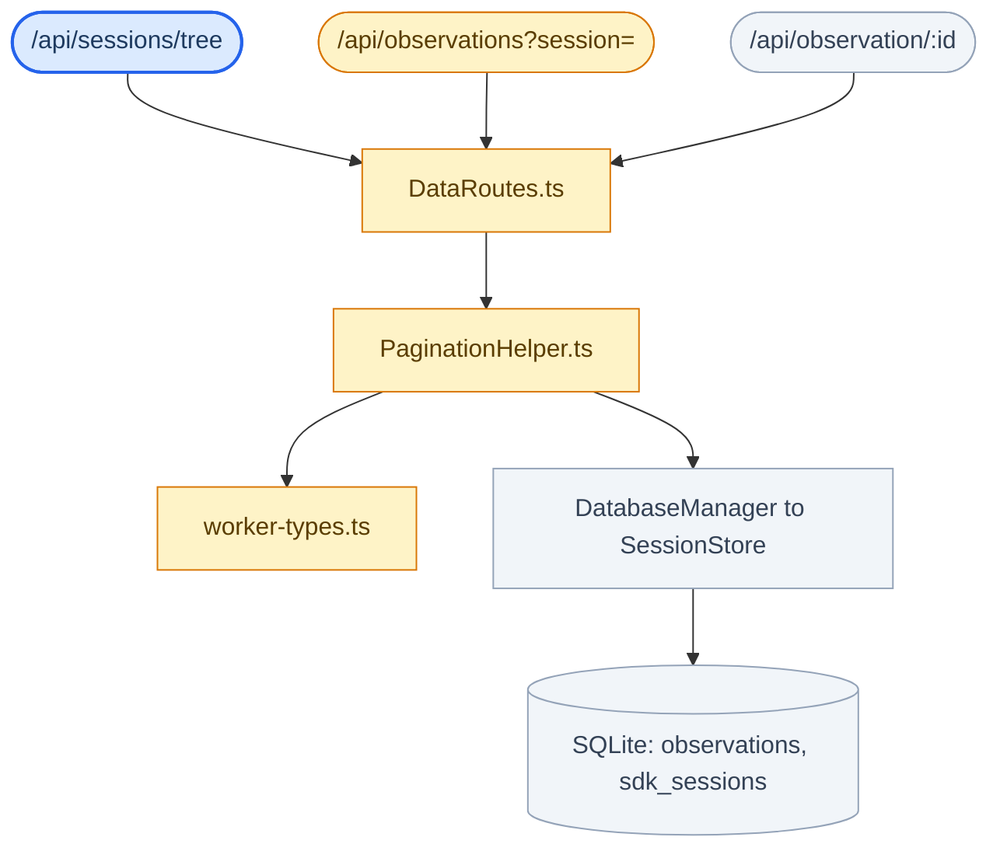

The [Explorer tab](/usage/viewer-explorer) spans the React viewer, the worker's
HTTP layer, and SQLite. Below is every edge between them, taken from the actual
`import` statements and route registrations rather than drawn from memory.

The whole graph is acyclic with a single root, `App.tsx`. It is split in two
here only so the labels stay readable — the three HTTP endpoints are the seam,
appearing as leaves in the first graph and roots in the second.

Blue nodes were added for Explorer, amber nodes already existed and were
modified, grey nodes are used unchanged.

## Viewer side

## Worker side

## What the shape tells you

**Three endpoints converge on `DataRoutes.ts`.** It is the single place where a
change to how sessions are scoped or paginated can break the tree, and it is
the file to read first when the tree disagrees with the Recall feed — both go
through it.

**`GET /api/observation/:id` hangs off `Explorer.tsx` directly**, not off
`useExplorerTree.ts` like the other two. That edge exists only for deep links:
opening `#/explorer/<id>` cold means nothing has loaded the observation yet, so
the component asks which session owns it before any session can be expanded.

**The tree carries two session ids.** `sessionId` is the `memory_session_id`
the observation query filters on; `contentSessionId` is what the viewer keys
expansion and page caches on, because the worker rotates the former whenever a
session continues.

**`ExplorerSession` appears twice** — once in `services/worker-types.ts` and
once in `viewer/types.ts`. The viewer's `tsconfig.json` pins `rootDir` to the
viewer directory, so it cannot import the worker's type; the two declarations
must be edited together.

**Nothing points back up.** No worker module imports a viewer module and no
hook imports a component, which is what keeps the graph acyclic. A new edge
that violates this — a shared helper importing `App.tsx`, say — would introduce
a cycle and should be split instead.
