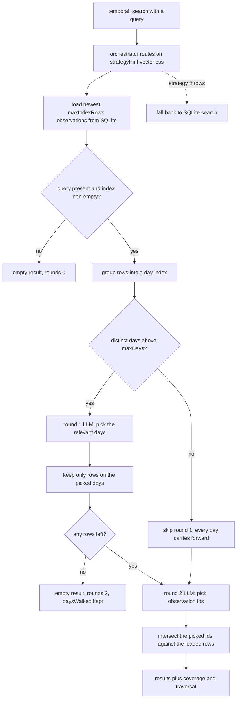

## What it is

An opt-in retrieval mode where an LLM walks a compact index of your memory
(one line per day: observation count, sessions, sources, sample titles),
picks the relevant days, then picks specific observations. No embeddings
involved, and the index is built fresh from SQLite on every query — it can
never go stale.

## How the walk works

The index is rebuilt from SQLite on every query, then narrowed in at most two
LLM rounds. Only the two nodes labelled `LLM` cost a model call.



The `rounds` field in `traversal` reports which path ran: `1` when the day
selection was skipped, `2` when it ran.

## When to use it

Use the `temporal_search` MCP tool when the answer spans multiple days or
branches of work — e.g. "how did the worker restart handling evolve over the
last two weeks?" Embedding top-k tends to cluster on one day; the index walk
sees the whole range in one pass.

## Enabling

In `~/.claude-mem/settings.json`:

```json
{
  "CLAUDE_MEM_VECTORLESS_ENABLED": "true"
}
```

Then restart the worker (`npm run worker:restart` from the plugin directory,
or restart Claude Code).

## Cost and bounds

Each query costs 1-2 model calls (using your `CLAUDE_MEM_MODEL`). Bounds:

| Setting | Default | Meaning |
|---------|---------|---------|
| `CLAUDE_MEM_VECTORLESS_MAX_INDEX_ROWS` | `500` | Max observations loaded into the walked index |
| `CLAUDE_MEM_VECTORLESS_MAX_DAYS` | `14` | Above this many days, a day-selection round runs first |

Measured against a 6,092-observation database with the index capped at the
default 500 rows: round 1 sends roughly 3k characters, round 2 roughly 40k
characters — about 10k tokens — and the whole walk takes 15-25 seconds on
`claude-haiku-4-5`. Lower `CLAUDE_MEM_VECTORLESS_MAX_INDEX_ROWS` if that is
too much per query; round 2 grows with the number of rows that survive the
day selection.

Chroma-backed search is untouched — `search` keeps using it. Vectorless only
runs for `temporal_search`, and only when enabled.

## Coverage breakdown

Every `temporal_search` result includes `coverage`: how many observations
per source (`claude`, `codex`, `cursor`, and any other `platform_source`
recorded, e.g. browser, docs, or Slack ingestions) were in the walked index
(`indexed`) and in the matched set (`matched`) — so you can see what the
retrieval actually looked at.

Results also carry `traversal`: `rounds` (1 or 2), `daysWalked`,
`sessionsWalked`, and `indexRows`.
