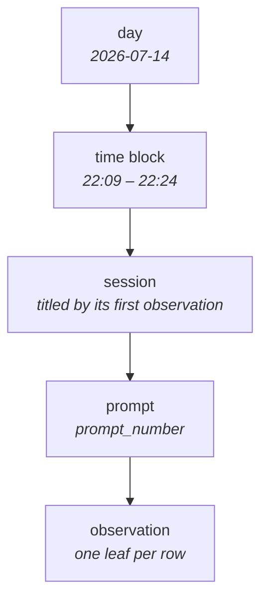

## What it is

The Explorer tab in the viewer (`http://localhost:37701/#/explorer`) draws one
day of memory as a tree: the day at the root, branching down through activity
to the individual observations along the bottom. It answers "what did that day
actually consist of" in a way the Recall feed cannot — the feed is one flat
stream, so the shape of a day is invisible in it.

## The five tiers

A **time block** is a run of activity with no gap longer than 30 minutes. Blocks
are found in a single pass over the day because the server returns the day
ordered oldest-first.

Switching to **By Project** replaces only the second tier — the project takes
the block's place and everything below is unchanged. It is the same data
regrouped, not a second request.

## Where the data comes from

`GET /api/explorer/day?day=&project=` returns three things: every day that has
observations (so the date stepper knows its neighbours), the day being shown,
and that day's observations projected down to what the graph draws — id, title,
session, prompt number, timestamp.

The narrative and text columns are deliberately left out. The graph paints a few
hundred nodes and only needs their labels; the detail panel fetches the full row
for the one observation that gets selected.

A live observation arriving over SSE refetches the day after a one second
debounce, for the same reason the counts are computed server-side: the client
holds a projection, not the source of truth.

## Why the session tier is keyed by content session

When a content session continues, the worker issues it a fresh
`memory_session_id`, rewrites that session's existing observations onto the new
id, and drops the old one — the session row itself is reused. Anything that
remembers a session across a refetch therefore cannot be keyed on
`memory_session_id`; it stops existing the moment new work lands in that
session. The graph groups its session tier on `contentSessionId`, which survives
the rotation.

## Reading the graph

- Node size and colour mark the tier: the day is the largest, observations are
  the small dots along the baseline.
- Hovering any node names it and gives its observation count.
- Clicking an observation opens it below the canvas and writes it into the URL
  as `#/explorer/<id>`, so the link survives a refresh and can be shared.
  Opening such a link cold switches to that observation's day first.
- Leaf labels are set on an angle because hundreds of them share one baseline.

## Toolbar

- **Tree / Digest / Activity** — only Tree is built; the other two are marked
  and disabled rather than hidden.
- **Day stepper** — moves between days that actually have observations, so it
  never lands on an empty one.
- **Time block stepper and Locate** — steps through the day's blocks and scrolls
  the canvas to centre the current one. Inactive under By Project, which has no
  time blocks.
- **By Time / By Project** — swaps the second tier.

The canvas fits the whole day's width where it can. Past the point where the
leaf dots would touch it stops shrinking and scrolls instead.
