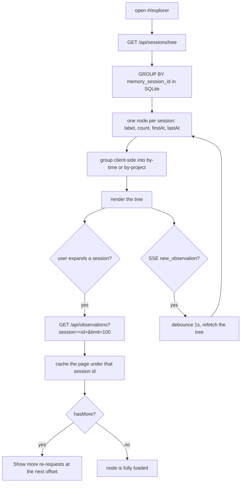
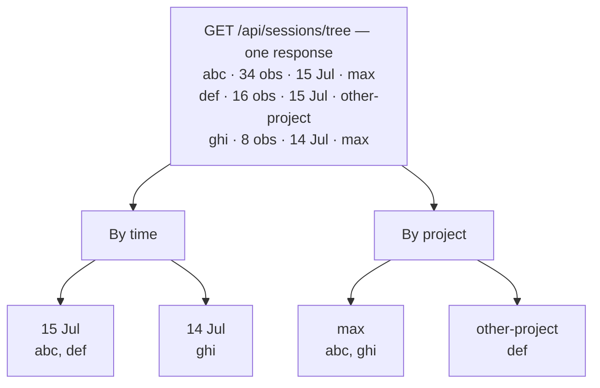

## What it is

The Explorer tab in the viewer (`http://localhost:37701/#/explorer`) shows your
memory as a tree — sessions on the left, the selected observation on the right.
It answers "what happened in that session" in a way the Recall feed cannot: the
feed is one flat stream, so a session's observations are scattered through it.

## Where the data comes from

Session counts are computed in SQL, not by grouping a page of the feed. The
viewer only ever holds the first page of observations, so counting client-side
would report "34 so far" instead of 34.

The SSE path refetches rather than merging the event into the tree. A node
carries a count, not the ids behind it, so there is no way to tell a live
observation apart from one already counted — merging would double-count it.

## Why nodes are keyed by content session

When a content session continues, the worker issues it a fresh
`memory_session_id`, rewrites that session's existing observations onto the new
id, and drops the old one — the session row itself is reused, so the session
count does not change. Anything the viewer remembers about a node therefore
cannot be keyed on `memory_session_id`: the moment a new observation lands in
an open session, the node it was keyed to no longer exists and the node
collapses.

Expansion and page caches are keyed on `contentSessionId`, which survives that
rotation. `memory_session_id` is still what the observation query filters on,
since that is the column observations carry. Deep links are unaffected —
observation ids do not rotate.

If a refetch shows a different count for a node whose children are open, that
node's cached page is reloaded, so the header and the rows cannot disagree.

## Two views of one fetch

The `By time` / `By project` toggle re-groups the same session list. It costs no
extra request.

## Session labels

A session id is a UUID, so the tree labels each node by falling back through
three sources:

1. `sdk_sessions.custom_title`, when one was set
2. the title of the session's oldest observation
3. `Session <first six characters of the id>`

The session's own `user_prompt` is deliberately not used — every `/doctor` run
produces an identical prompt, so those sessions would be indistinguishable.

## Deep links

Selecting an observation writes it into the URL as `#/explorer/<id>`. Opening
that link directly asks the server which session owns the observation, expands
that session, and scrolls the row into view — so a link survives a refresh and
can be shared.

## Project filter

The tree honours the header's project selector and scopes exactly like the
Recall feed does, matching `project` or `merged_into_project` and hiding the
internal observer-sessions project when no filter is set. A tree that scoped
projects differently from the feed would disagree with it on the same filter.
